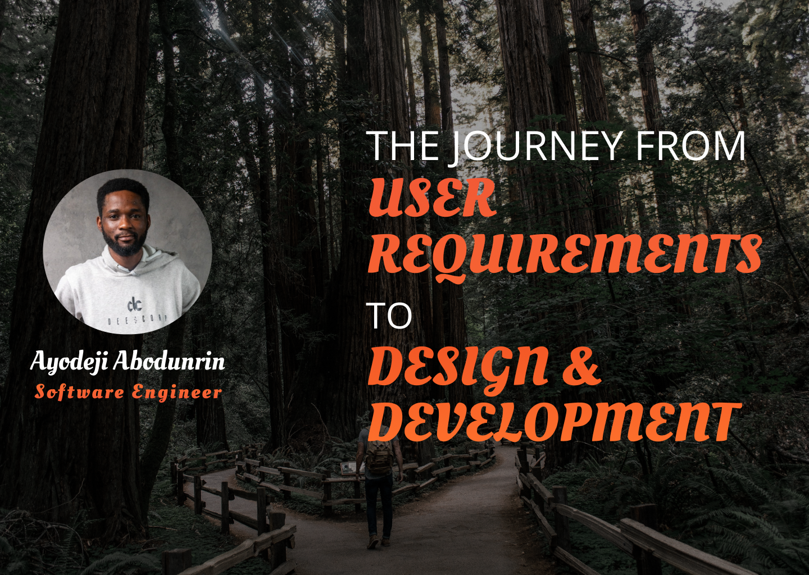

I was invited by the Digital Tech Community Quartz Group of the Covenant Nation Community Groups to speak on the above topic. The session was insightful with above 20 people in attendance.

#### Points discussed included:

- Software Development Life Cycle
- User Requirement In-Dept
- Converting user requirements to user stories
- Design and Prototyping
- Bringing it all together - Workshop.

<h4>
<a href="https://www.figma.com/proto/OqCjyr7bqHbT7bp9RVp5sN/Mockup-Design?node-id=1222%3A127&scaling=min-zoom&page-id=1222%3A126" target="_blank">View Slides </a>
</h4>
