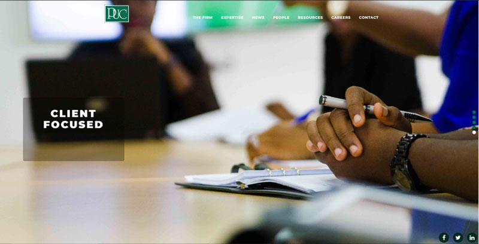

In 2017, I revamped the website of Paul Usoro & Co Legal Practitioner, a leading law firm in Nigeria (the Firm). The Firm's defunct website required a  modern outlook that would properly portray the professionalism and leadership of the Firm in the Nigerian Legal Practice, devoid of issues.

### Prior to the revamp

#### Landing Page

#### About Section

#### People Page

### Issues with the initial website

- Rigid and Non-responsive design. This made it difficult for non desktop users (mobile, tablets, etc. users) to view the website
- Static Page
- Poor Aesthetics

### Solution

The solution was to revamp the website to have a modern look targeting the latest design trends and ensuring simplicity. In doing so, I prepared on two attempts, a design which was accepted by the Managing Partner and adopted for the refurbishment.  The development process for the new design entailed a new photography session for staff of the Firm and a subsequent user acceptance test to the satisfaction of the Partners before deployment.

### After Revamp Screens

#### Landing Page

  

#### About Page

#### People Page

 

#### Click image to visit website

