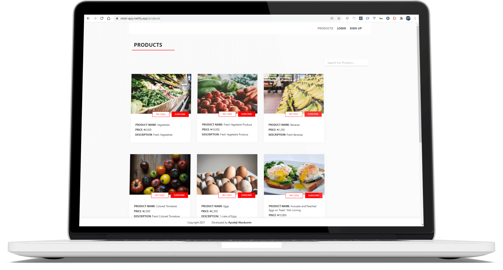
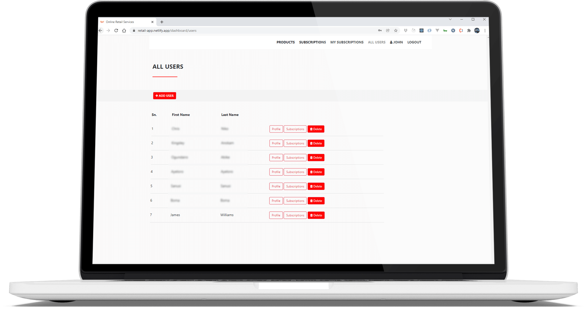
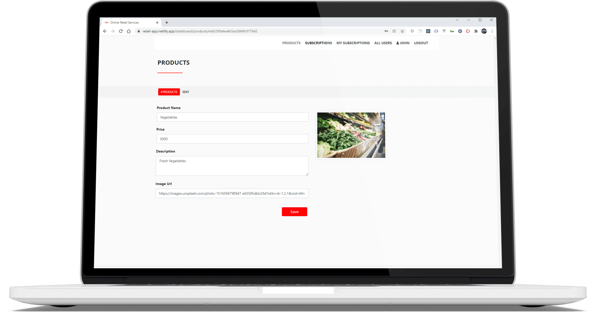
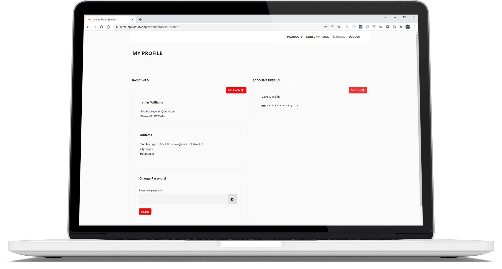
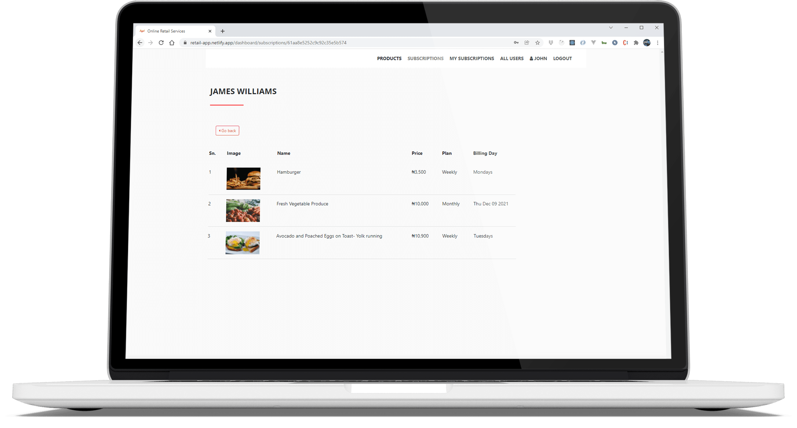
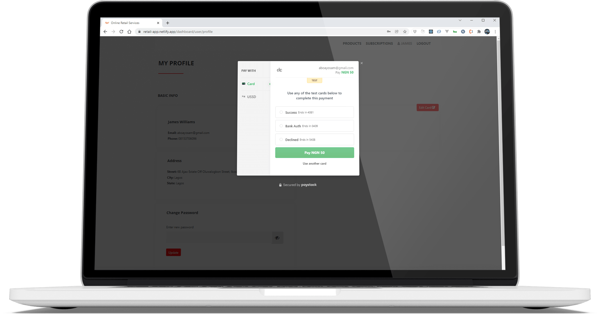

The online retail app is a platform where users (clients, customers, or businesses) can browse through a catalogue of available products and services. With its flexible model, users can either subscribe to a list of available products and services or opt-in for a one-off payment.

### Features of the platform

- Users can browse through a catalogue of available products and services
- An admin user can manage all users that have registered on the platform (add new users, edit existing user details, and restrict user access)
- A user can subscribe to a list of products or services. The subscription plans include hourly, daily, weekly, and monthly.
  - Users will be billed automatically on their scheduled billing date based on their subscription model.
- A user can make a one-time payment.
- An admin user can manage all users' subscriptions
- A user can manage his or her profile.
- A user can add and remove debit cards.
- Users on subscription are notified when billing is about to occur on their account.
- Automatic retry when billing fails.

#### Admin View - All Users

#### Admin View - Edit Product / Service

#### User View - Profile

#### User View - All products subscribed to

#### User View - Add Debit Card

#### <a href="https://retail-app.netlify.app/" target="_blank" title="Go to Demo App">View Demo website - Online Retail Store</a>

`Sample Login credentials for the demo app is in the readme file of github repo below`

#### <a href="https://github.com/omob/online-retail-application" target="_blank" title="View Github Repo">View Github Repo</a>
