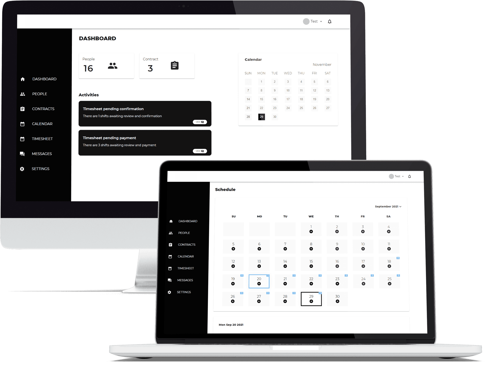
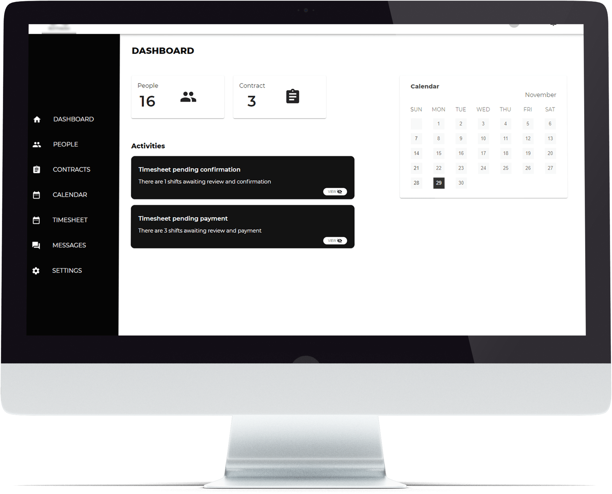
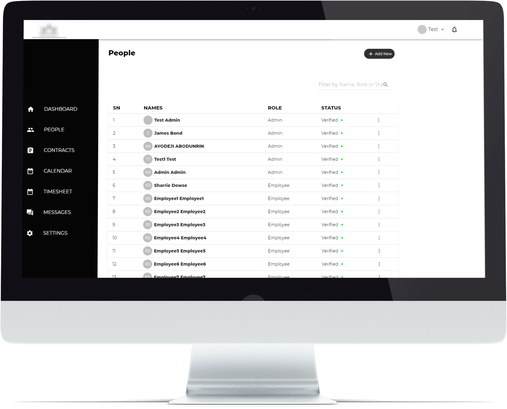
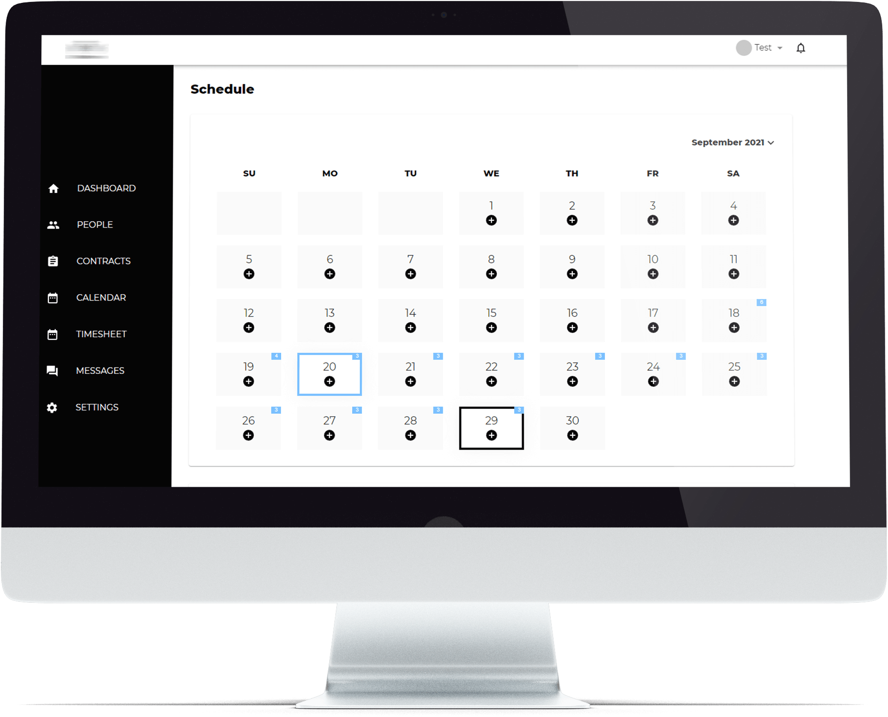
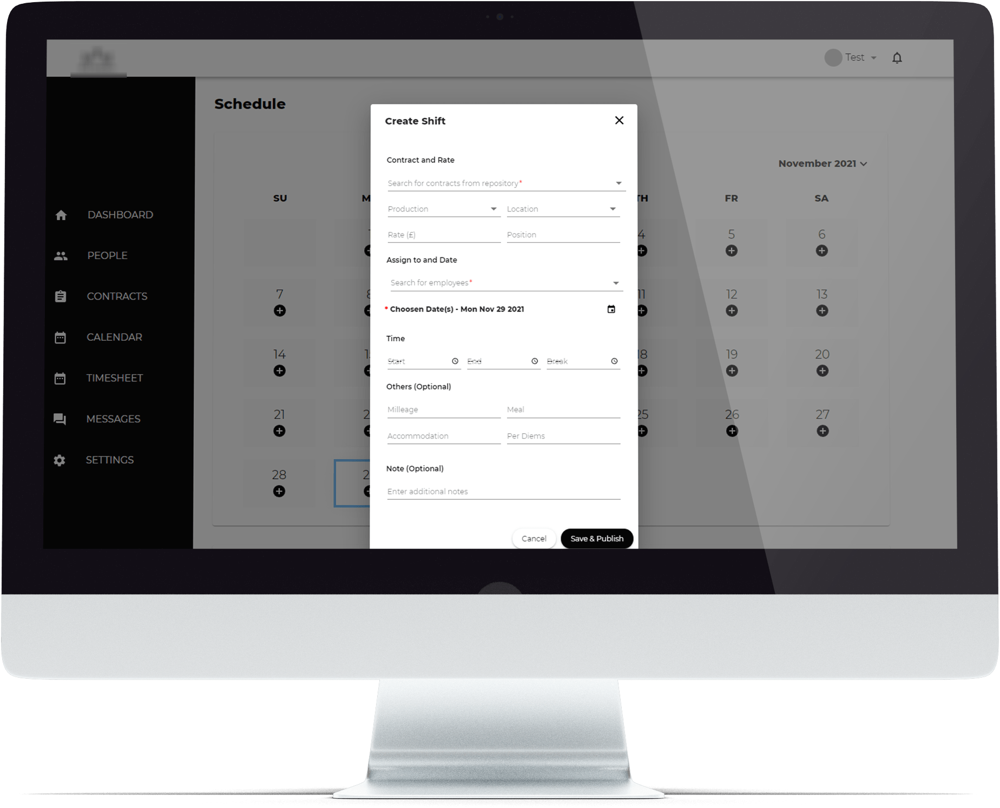
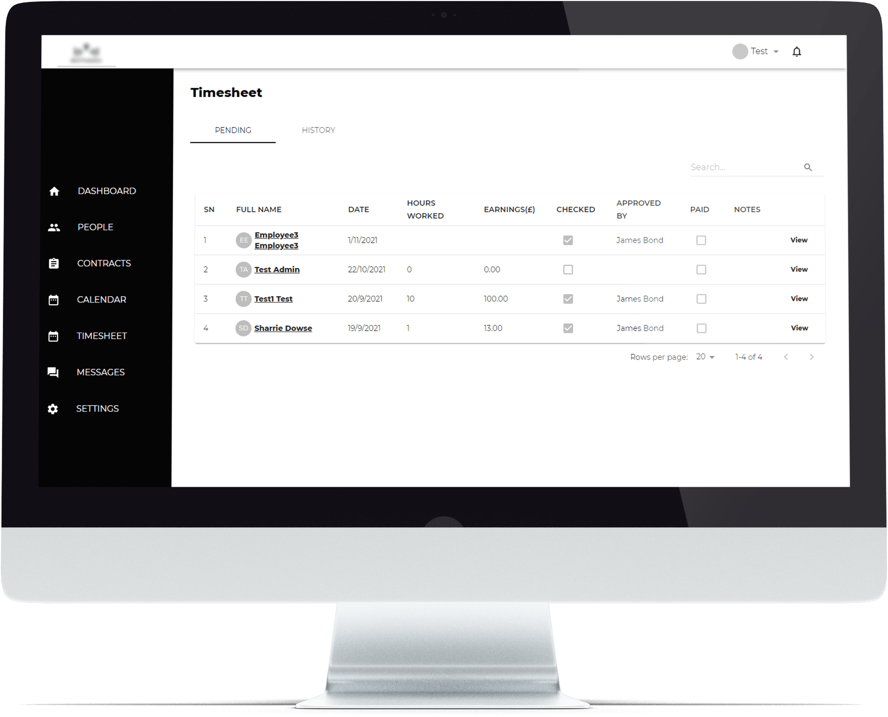
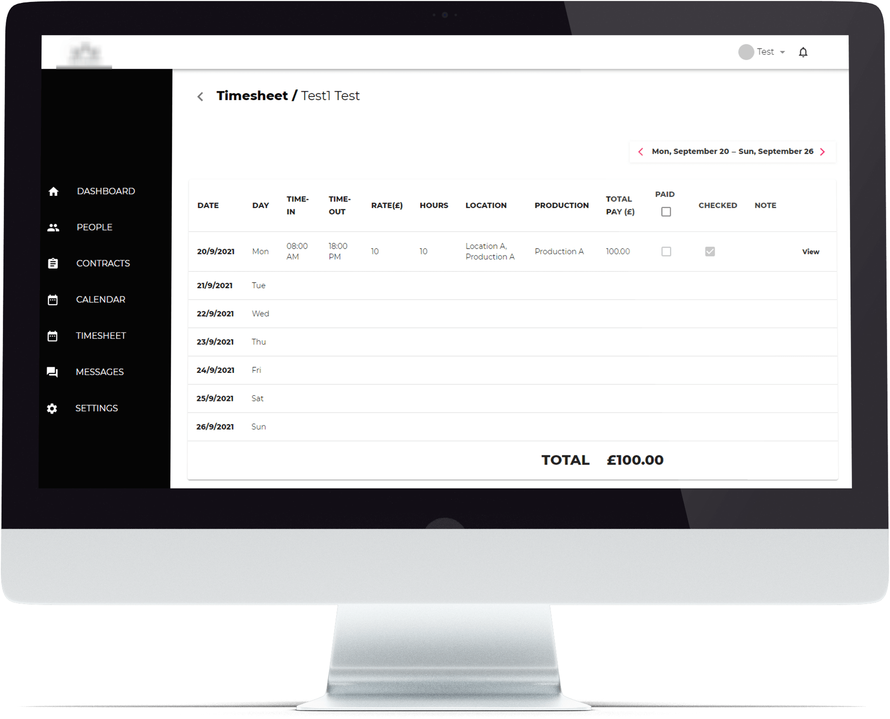

## Case Study

The Company is a security company where everything was manual. The processes for screening, onboarding, scheduling, client management, and administration were done with pen and paper, WhatsApp groups, and Excel spreadsheets.

Typically, potential employees had to go through a long, cumbersome verification process, employees learned what they had to do each day in WhatsApp groups, while administrators manually entered all work information into Excel spreadsheets. This process required extra time, care, and effort and proved to be time-consuming, hectic, and error-prone for both managers and employees.

## The Solution

A web application was developed for administrators and a mobile app for employees. The web app made it not only possible but easy for managers to:

- See the number of clients and employees at a glance at any time.
- View each employee's profile, documents, schedules, and respective salary without having to dig through endless sheets and papers
- Review each potential employee in just 5 minutes
- Add new employees to the company database extremely quickly
- Manage clients, contracts, locations, and the total number of employees assigned to them.
- Monitor employees, assigned locations / shifts, salaries, and required mileage.
- Easily assign and reassign shifts as needed
- View each employee's work history
- View any discrepancies and pay each employee correctly.
- Easily keep track of the company's income and expenses.
- Instant messaging between Employees and Administrators.

And with the mobile app, employees can:

- Upload/update documents and get them approved very quickly
- Manage or edit their profiles without having to wait for someone to do so
- See all the shifts assigned to them at a glance
- Accept or decline any shift without having to call or wait forever for approval
- Have access to and accept extra shifts to earn extra money.
- See other employees who are assigned to their location
- Know their supervisors for each job
- Plan their lives better and have a better work-life balance when they know their daily assignments ahead of time.
- Get accurate pay
- See in-app notifications and have live chats with management when needed.

Of course, work has become easier for both employees and management.

The apps developed for the security company gives them more transparency and accuracy, saving everyone time and effort.

### Some of the application Screens

#### Home Page

#### People Page

#### Schedule Page

#### Create New Shift Page

#### Timesheet Page

 

#### Technology Stack - Node.js, React, and MongoDB
