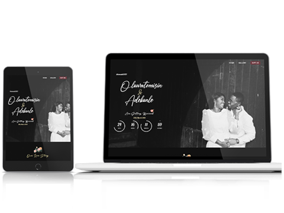
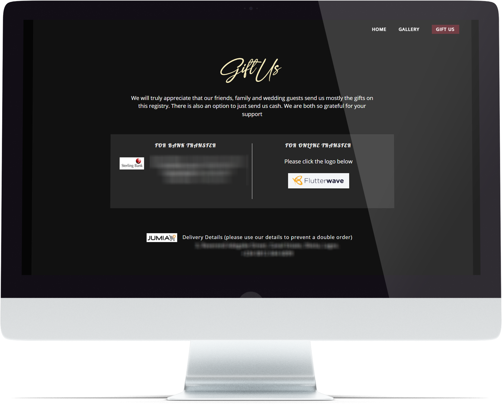
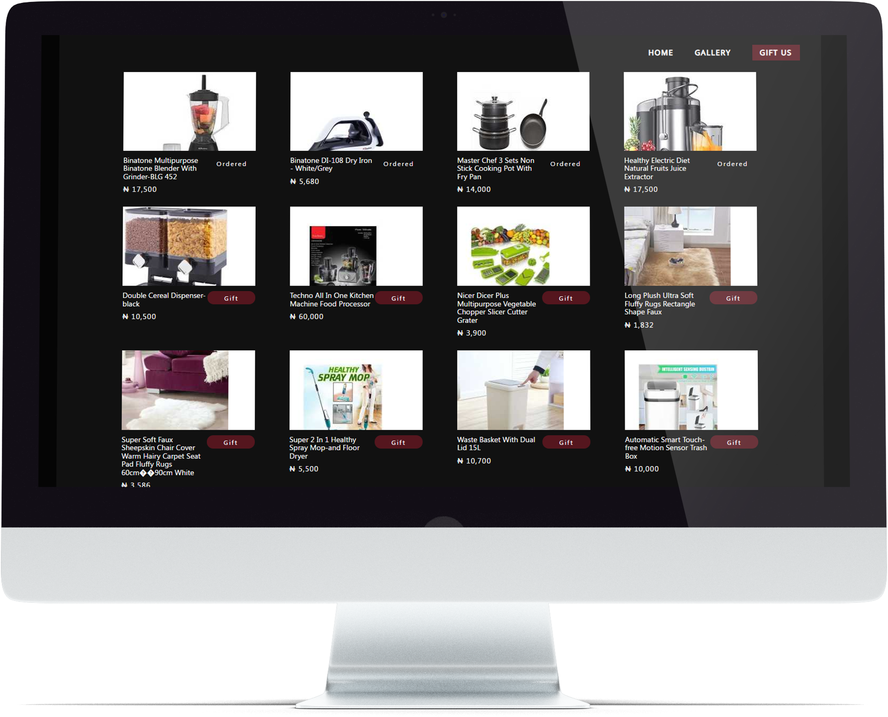

## Love is beautiful.

When Tomisin and Samson got engaged, they wanted a website where their loved ones could read their love story, view their beautiful picture gallery, and easily send them wedding presents- in cash or in kind.

And that's exactly what I gave them!

The website was amazingly simple, inviting, and user-friendly.

Well-wishers could easily choose to send the couple monetary gifts via bank transfer or Flutterwave.

And those who wanted to purchase gifts could choose from a range of items the couple had requested. What could be better than giving someone exactly what they want?

### Home Page

### Gallery

### Gift Page

And oh, the couple loved their website!
 

<h5>
<a href="https://tomade2021.netlify.com/" target="_blank"> Go to website</a>
</h5>

<h5>
<a href="https://github.com/omob/tomade2021/" target="_blank"> View Github Repo</a>
</h5>

#### Technology Stack - Node.js, Gatsby, and Contentful CMS
