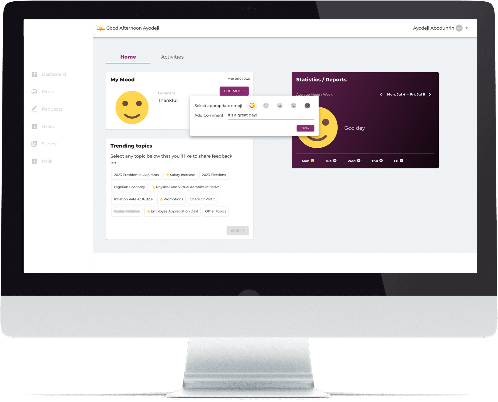
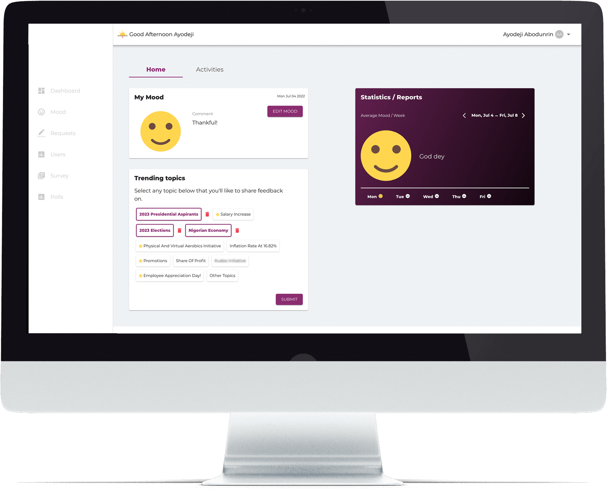
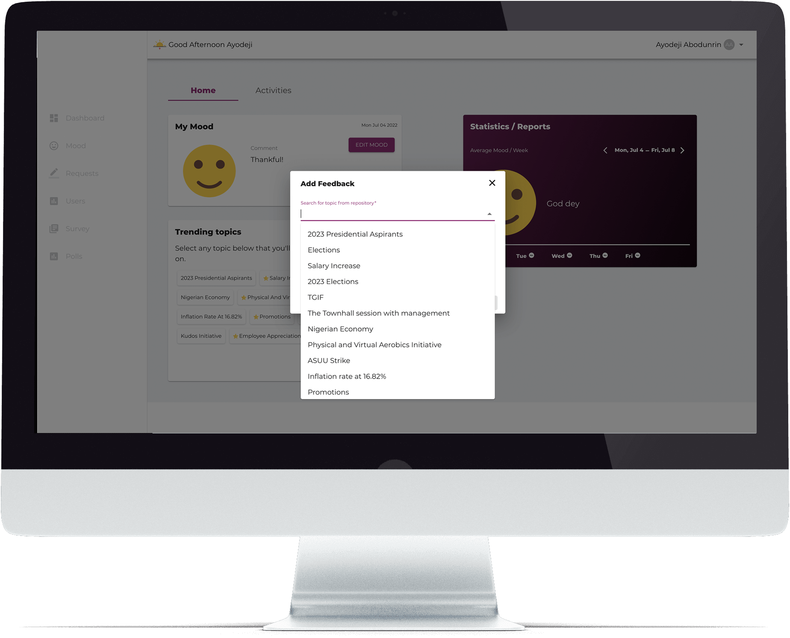
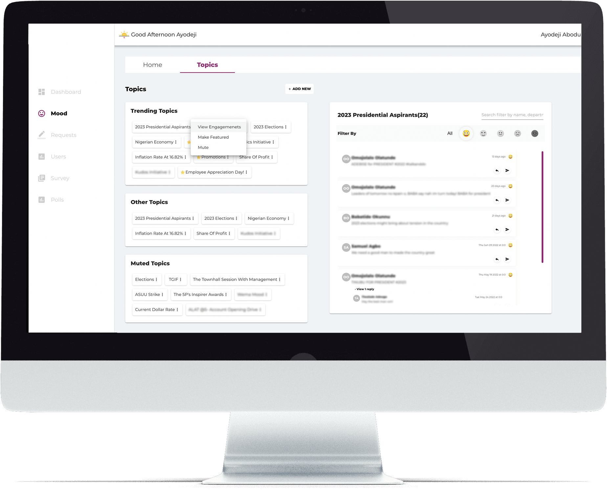
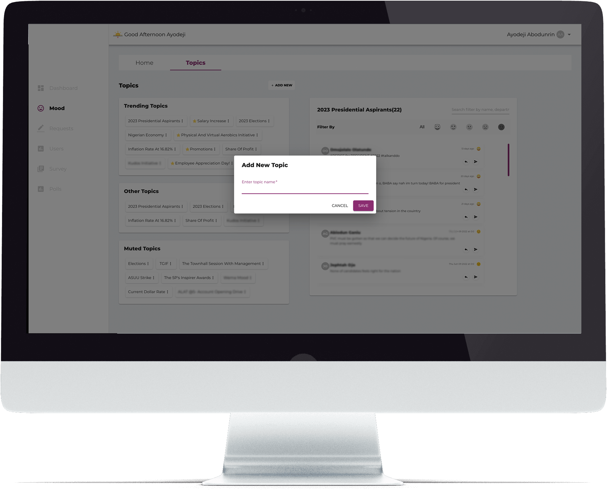
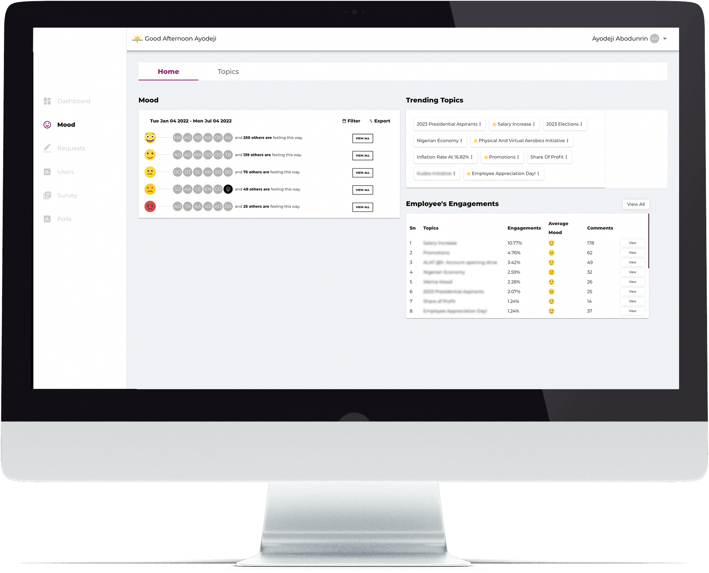
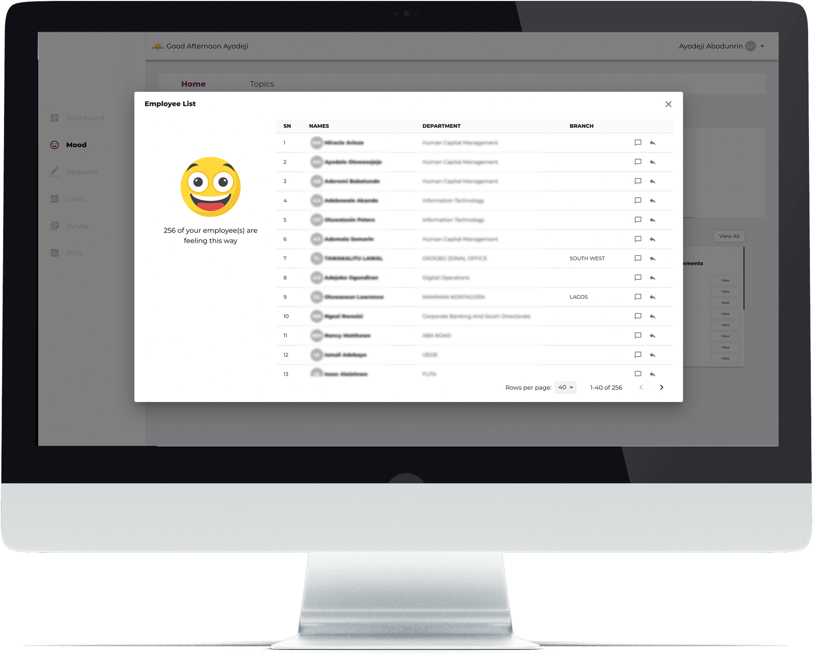
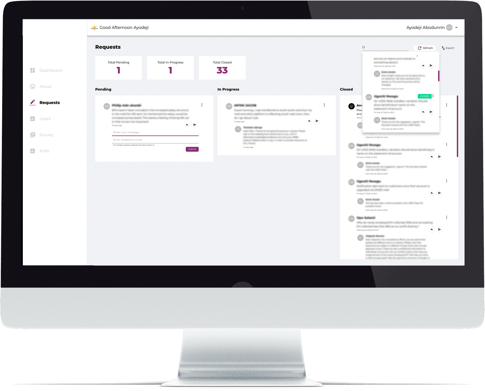
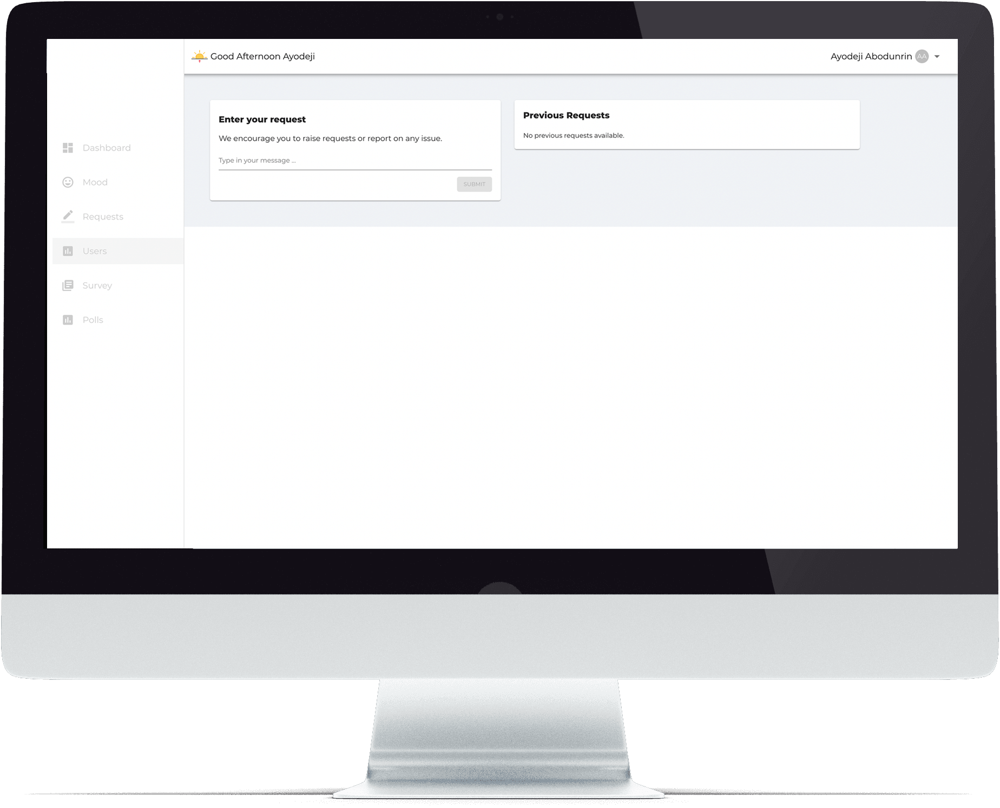

### Introduction

The scope of this project was to develop an automated self-service feedback platform for all employees within the organization. The application provided a standardized channel for employees to provide immediate feedback on salient issues that may be affecting attitude and productivity. The project contains four (4) independent modules which includes; the Mood Module, the Request Module, the Polls Module and, the Survey Module.
In this system, there are 3 major user actors – Admin, Employee, and Anonymous – with each having disparate view and interactions with the system.

#### The Mood Module

The Mood Module allowed users to set their mood for the current day and allows admin users view the mood of employees across the organization. This module also allows users to view different topics published by admin and give feedback on these topics. A topic could be in different states.

- Muted - These are topics restricted by Admin and they do not want to receive feedbacks on them anymore. These set of topics are not visible to the employees. A usecase of this could perhaps be that the topic is receiving more traction than the featured topics.
- Featured - These are topics with high priority that Admin wants to receive feedback on. They have a star icon state.
- Trending - These are topics with high number of engagements. They have a fire icon state.
- No State - These are topics without any state.

Below is a detailed functional specification on how each actor interact with the System.

| Sn  | Actors                       | Functionalities                                                                                                                                          |
| :-: | :--------------------------- | -------------------------------------------------------------------------------------------------------------------------------------------------------- |
| 1.  | Employee                     | Sign in (email and password) or access the platform anonymously                                                                                          |
| 2.  | Anonymous/Signed-In Employee | Can view the home dashboard asking how your mood is for the day                                                                                          |
| 3.  | Anonymous/Signed-In Employee | Can add optional comment to selected Mood                                                                                                                |
| 4.  | Anonymous/Signed-In Employee | Can Edit Mood set for the day                                                                                                                            |
| 5.  | Anonymous/Signed-In Employee | Can view trending and featured topics and reply with mood and optional comment concerning those topics                                                   |
| 6.  | Anonymous/Signed-In Employee | Can search for other topics not featured or trending and engage with same via setting mood and optional comment on them                                  |
| 7.  | Anonymous/Signed-In Employee | Can view engagements activities on various topics  and admin response                                                                                    |
| 8.  | Signed-In Employee           | Can view statistics/report of my mood per week                                                                                                           |
| 9.  | Anonymous Employee           | Cannot see statistics/report of my mood that week.                                                                                                       |
| 10. | Admin                        | See a Home Screen containing all modules (mood, polls, request and survey)                                                                               |
| 11. | Admin                        | View how employees are feeling at a glance for that day on the Mood dashboard                                                                            |
| 12. | Admin                        | Filter the overall employee’s mood by week or month on the Mood dashboard                                                                                |
| 13. | Admin                        | See trending topics and featured topics on the Mood dashboard                                                                                            |
| 14. | Admin                        | Mute trending topics on Mood dashboard                                                                                                                   |
| 15. | Admin                        | Mark a topic as featured on Home Screen                                                                                                                  |
| 16. | Admin                        | See top 5 topics that employees are engaging on at a glance with their overall reports, i.e. average mood, comments and total engagements on Home Screen |
| 17. | Admin                        | View all employee's engagements                                                                                                                          |
| 18. | Admin                        | View Topics Screen or page that contains all topics and engagements on these topics                                                                      |
| 19. | Admin                        | See all trending, muted and other Topics on this page                                                                                                    |
| 20. | Admin                        | Mute, feature, unmute, unfeature a topic                                                                                                                 |
| 21  | Admin                        | View all the comments on a topic                                                                                                                         |
| 22. | Admin                        | Filter a topic by mood                                                                                                                                   |
| 23. | Admin                        | Search for a comment by username, userid, department or branch                                                                                           |
| 24. | Admin                        | Reply a comment                                                                                                                                          |
| 25. | Admin                        | Escalate a comment                                                                                                                                       |
| 26. | Admin                        | Click a link in the escalation mail, to take them back to that comment that the escalation was made.                                                     |
| 27. | System                       | Notify Admin via mail when users select an angry mood                                                                                                    |
| 28. | System                       | Daily notification of Users to set their Mood via Mail                                                                                                   |
| 29. | System                       | Daily notification of Users to set their Mood via Desktop application                                                                                    |

#### Some Employee Dashboard Screens

|                                                                                                               |                                                                                                                             |
| :------------------------------------------------------------------------------------------------------------ | :-------------------------------------------------------------------------------------------------------------------------- |
|        |           |
|  |  |

#### Some Screens for Admin

|                                                                                                             |                                                                                                                                |
| :---------------------------------------------------------------------------------------------------------- | :----------------------------------------------------------------------------------------------------------------------------- |
|        |           |
|  |  |

### The Request Module

The Request Module allowed employees raise requests regarding any issue. An admin user can view all the requests raised and their respective status (pending, in-progress or closed). Below is a detailed functional specification on how each actor interact with the System. Users are being notified when the status of their request changes.

| Sn  | Actors                        | Functionalities                                                                                               |
| :-: | :---------------------------- | ------------------------------------------------------------------------------------------------------------- |
| 1.  | Anonymous/Signed-In Employee  | See the request dashboard with the text field telling me to Enter my Request                                  |
| 2.  | Anonymous/Signed-In Employee  | See the list of previous requests raised and their respective status and comments from admin (if applicable)  |
| 3.  | Signed-In Employee            | Receive Notification Via Mail when the Status of my Request Changes                                           |
| 4.  | Admin                         | See the request dashboard showing total number of requests on the system – Pending, InProgress, and Closed    |
| 5.  | Admin                         | See all Pending Requests, InProgress Requests, and Closed Requests                                            |
| 6.  | Admin                         | Reply a User Request                                                                                          |
| 7.  | Admin                         | Escalate User Request to Email addresses                                                                      |
| 8.  | Admin                         | Search for a request either by Username, UserId or RequestId                                                  |
| 9.  | Admin                         | Change Status of a Request to Either – Pending, InProgress or Closed                                          |
| 10. | System                        | Send mail to Admin Users when a new request has been raised by Employees                                      |
| 11. | Admin                         | See the request dashboard showing total number of requests on the system – Pending, InProgress, and Closed    |
| 12. | Admin                         | See all Pending Requests, InProgress Requests, and Closed Requests                                            |
| 13. | Admin                         | Reply a User Request                                                                                          |
| 14. | Admin                         | Escalate User Request to Email Addresses                                                                      |
| 15. | Admin                         | Search for a request either by Username, UserId or RequestId                                                  |
| 16. | Admin                         | Change status of a Request to either - Pending, Inprogress, or closed                                         |
| 17. | System                        | Send mail to Admin users when a new request has been raised by an employee.                                   |

#### Admin Dashboard for the Request Module



#### Employee View for the Request Module



---

```sh
Polls and survey screens will be added soon... 😊
```

---

## Architecture

The solution consists of

- Web API Layer
- Web Portal
- Background Services (Cron Jobs)
- Desktop Application
- Database

### Web API Layer

This is API built to perform all functions required of the portal. The methods are grouped into Controllers based on their purposes. These include:

`AdminController` – Contains all the routes request for users with Admin Role - [/api/admin]

`AuthController` – Contains route requests for authentication. Both for Anonymous and Non-Anonymous users – [/api/auth]. For non-anonymous users, this handles interaction with the Authentication Microservice. Authorization uses JWT token which a caller must pass at subsequent calls for all routes except Notifications.

`MoodController` – Contains route related to fetching of different Moods – [/api/moods]

`NotificationController` – Contains routes for sending notifications via the API endpoint and also executing the TrendingTopic Algorithm when the endpoint is called, to determine and set which topic is trending – [/api/notifications]

`TopicController` – Contains routes for fetching topics and management of same by Admin users – [/api/topics]

`UserController` – Contains routes for User Management – [/api/users]

`UserMoodController` – Contains routes for managing User Moods – [/api/users]

`UserTopicController` – Contains routes for managing User Topics – [/api/users]

`UserRequestController` – Contains routes for managing User Requests

### Web Portal

The web portal is the front-end interface that is used by employees to engage with the application. It is built using React.js JavaScript library and it interfaces solely with the Web API layer.

### Background Services

These are two services which run in the background. These include:

`NotificationCron` – This is a console application that when executed, calls the `notifications/setmood` api endpoint. This sends email notification to all users on the system on setting their mood. This service is scheduled to run twice a week at 9:00am and 2:30pm on Windows Task Scheduler.

`TrendingTopicsCron` – This is a console application that when executed, calls the `notifications/set-trending-topics` endpoint. This runs an algorithm to determine which topic is trending and changes its status to ‘TRENDING’. This service is scheduled to run every 5mins on Windows Task Scheduler.

### Desktop Application

This is a desktop application that pops up on users’ system, prompting them to set their Mood on the Mood Platform. This application is scheduled on Task Scheduler to run twice every week.

---

---

### Thanks for reading 😊 🏌🏾‍♂️🏌🏾‍♂️🏌🏾‍♂️
