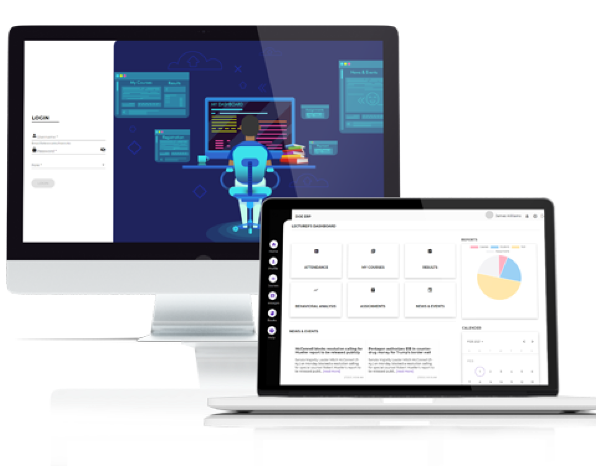
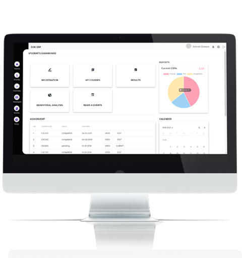
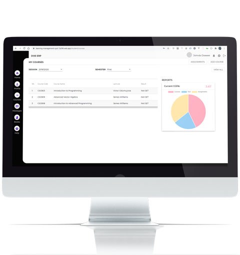
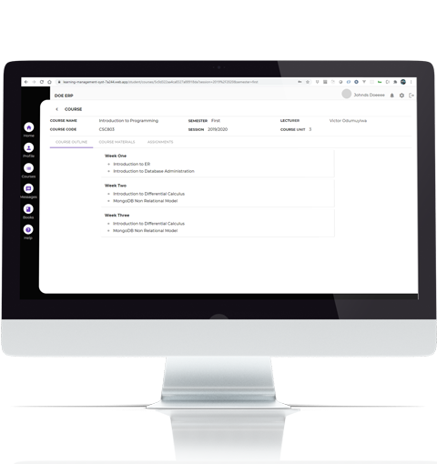
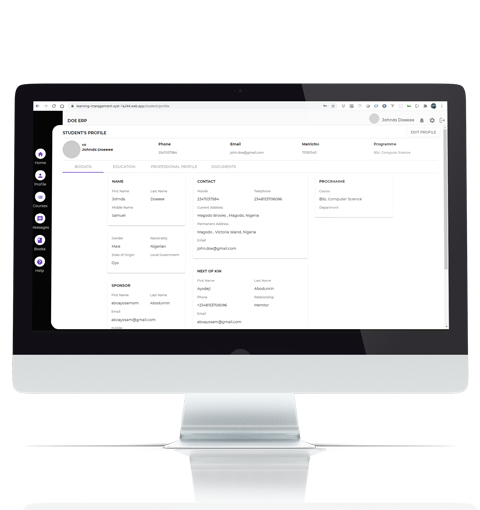

In an attempt to improve the student/lecturer relationship, I developed a learning management system (LMS) with a feature for result processing. The solution incorporates a learning management system and a system for record processing.

A learning management system is an application that is helpful within the administration hierarchy of a university; it aids the documentation, tracking, lecture, and delivery of academic courses, coaching programs, or other education and development programs.

## Problem Definition

The student learning management system and student record system are both systematic processes of collecting, processing, storing, and transmitting important information to sustain the operations of the various departments in educational organizations like a university. Accessing information in most Nigerian Universities has posed to be problematic due to the lack of a software or application that incorporates a student management system in conjunction with a student record system.

There is considerable evidence that the University management system is faced with reoccurring issues associated with the management of students’ records, results, class activities, and others. There is a need for the development of an application that provides both a student learning management system and a student record system on the go, thus increasing the effectiveness and efficiency of each department that makes up the university hierarchy.

## Solution

A developed application with a learning management system and student record system can be used to solve this problem, as the software makes it easy to monitor the progress of every student and department of the school, and automate their different functions.

With such an application in place, everything involving the school’s regular activity can be seen on a single dashboard. Also, the development of this software for a university will abolish the need for having multiple management software for each department, aid the long term management and planning of all the departments of the university, and reduce the chances of mistakes in typing and re-entry of data which is common in the university management systems where it is done manually and prone to human mistakes and errors. The benefits embedded in the adoption of single application software that manages both the learning management system and student records in universities are endless.

#### Student View - Home Page

#### Student View - Courses Page

#### Student View - Courses Detail

#### Student View - Profile Page

#### [Go to Demo App](https://learning-management-syst-7a244.web.app/ "LMS System")

`Login credentials for the demo app is in the readme file of github repo below`

#### [View Github Repo](https://github.com/omob/LMS-FRONTEND "LMS FE")
