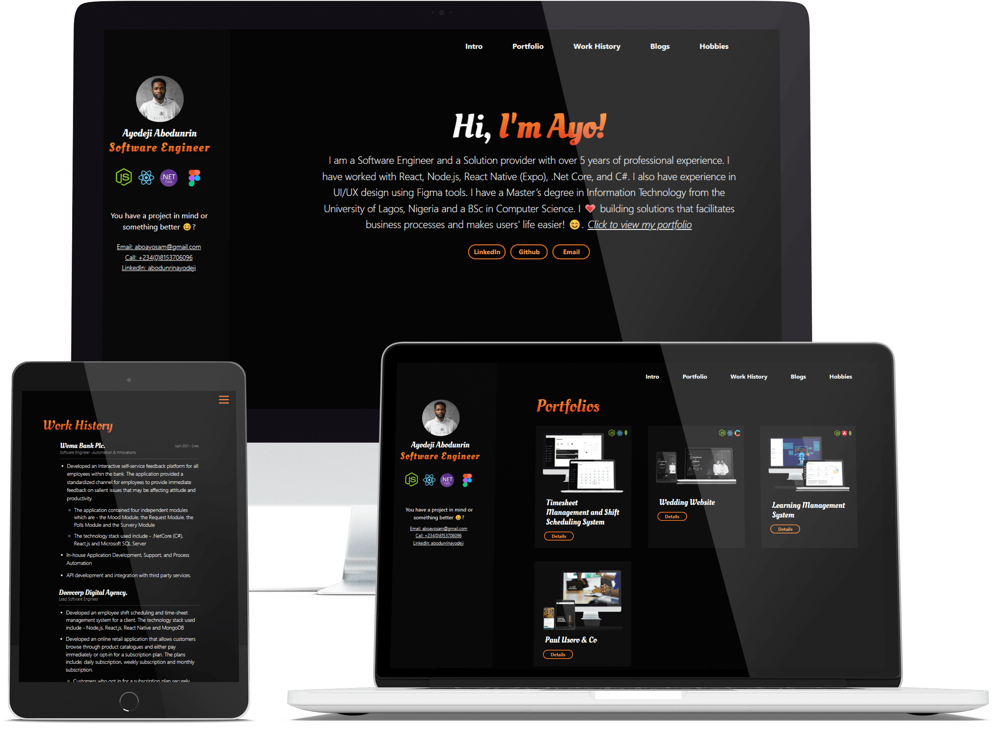

This portfolio website was made with love to easily help developers put their work out there. I've spent some time to make it as easy as possible for any one to adopt with little modifications and get running. The tech stack used is Gatsby (React Static Site Generator Framework ) and Markdown.

#### [View Github Repo](https://github.com/omob/ayodeji-abodunrin-website/ "Ayodeji Abodunrin Portfolio Website")

