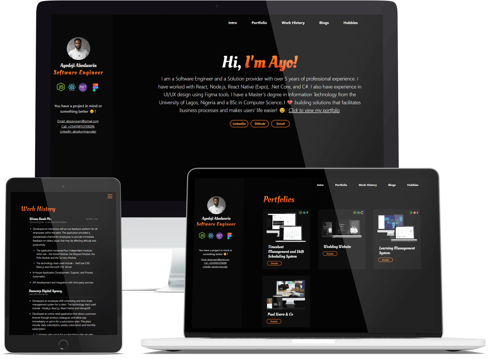

This portfolio website was built with love to help developers beautifully showcase their portfolio. I've spent some time to make it as easy as possible for anyone to adopt with little modifications and get running. The tech stack used is Gatsby (React Static Site Generator Framework ) and Markdown.

#### <a href="https://github.com/omob/ayodeji-abodunrin-website/ " target="_blank" title="Ayodeji Abodunrin Portfolio Website ">View Github Repo</a>
